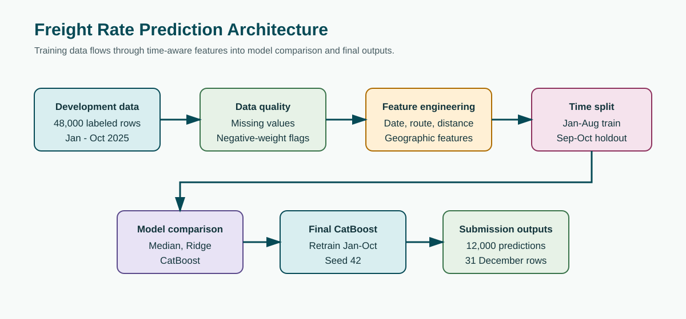
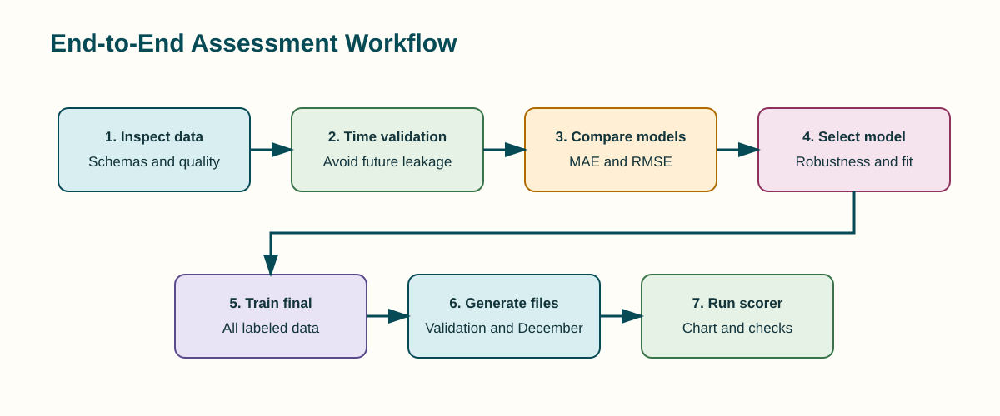

# Spotter Freight Rate Prediction

Machine learning solution for Spotter's **Freight Rate Prediction Challenge**. The project estimates the posted freight rate for future loads using a reproducible, time-aware tabular regression pipeline.





## 1. Business Problem

Spotter needs to estimate the expected rate for a freight load before the load is priced. Each load contains operational, geographic, equipment, weight, market, and timing information. The model must learn from historical labeled loads and produce a positive dollar-valued rate for future loads.

This is a **supervised regression** problem:

```text
Input load features -> predicted posted_rate
```

The target is `posted_rate` in `data/train-test.csv`.

## 2. Assessment Objective

The assessment requires the following:

1. Explore and clean the labeled development data.
2. Decide how to split and validate the development data.
3. Engineer useful features without leaking future or target information.
4. Compare appropriate regression models.
5. Predict all 12,000 rows in `data/validation.csv`.
6. Fill the supplied prediction template and save `validation_predictions.csv`.
7. Predict the 31 fixed December scenarios.
8. Run the supplied `score.py` validator.
9. Submit code, dependencies, run instructions, predictions, a report, a chart, and a 2-3 minute Loom walkthrough.

## 3. Dataset Overview

| File | Role | Size |
|---|---|---:|
| `data/train-test.csv` | Labeled development data | 48,000 x 14 |
| `data/validation.csv` | Final feature-only prediction data | 12,000 x 13 |
| `data/validation-predictions-template.csv` | Official prediction template | 12,000 x 2 |
| `data/december-chart-inputs.csv` | Fixed December scenario inputs | 31 x 7 |

### Development data

The development data covers January 1 through October 31, 2025. It contains the target column `posted_rate`.

### Final validation data

The final validation data covers November 1 through December 31, 2025. It contains the same input features but does not contain the target. Each row has a unique `load_id`.

### December scenario data

The December file contains one load scenario for each day from December 1 through December 31, 2025:

- Pickup: Lexington
- Delivery: Fort Wayne
- Distance: 360 miles
- Equipment: Dry Van
- Weight: 32,000 pounds
- Only the date changes

The completed file is used by `score.py` to generate `scorer_results/candidate_december.png`.

## 4. Input Features

| Feature | Type | Description |
|---|---|---|
| `load_id` | Identifier | Unique load identifier; not used as a predictive feature |
| `pickup` | Categorical | Pickup city |
| `delivery` | Categorical | Delivery city |
| `pickup_lat`, `pickup_lon` | Numeric | Pickup coordinates |
| `delivery_lat`, `delivery_lon` | Numeric | Delivery coordinates |
| `distance` | Numeric | Load distance in miles |
| `equipment` | Categorical | Dry Van, Reefer, or Flatbed |
| `weight` | Numeric | Load weight |
| `date` | Date | Load date |
| `market_index` | Numeric | Market condition signal |
| `quote_signal` | Numeric | Quote-related signal |
| `posted_rate` | Target | Historical posted freight rate |

## 5. Data Quality Findings

The analysis identified the following issues:

- 300 missing `weight` values in development data.
- 374 missing `market_index` values in development data.
- 292 negative weights in development data.
- 165 missing weights in final validation data.
- 249 missing market indices in final validation data.
- 145 negative weights in final validation data.
- Eight pickup cities and eight delivery cities appear in validation but not development.
- 736 validation routes are not observed in development.
- No duplicate full rows or duplicate load IDs were found.

Suspicious observations were not deleted automatically. The pipeline preserves raw values and creates explicit indicators for missing and negative weights. It also creates `weight_clean`, which is non-negative and is used only for weight-derived features.

## 6. Exploratory Findings

- The target is right-skewed.
- Mean target: approximately `$2,373.98`.
- Median target: approximately `$2,030.76`.
- Minimum target: `$57.22`.
- Maximum target: `$25,533.00`.
- Distance has a raw correlation of approximately `0.909` with `posted_rate`.
- Average rates differ across equipment categories.
- New routes and cities mean that route memorization alone would be unreliable.

## 7. Validation Strategy

A random split was not used as the main validation strategy. The final prediction period occurs after the development period, so a random split could mix earlier and later observations and produce an overly optimistic estimate.

The project uses this time-based holdout:

| Partition | Dates | Rows |
|---|---|---:|
| Development portion | 2025-01-01 to 2025-08-31 | 38,477 |
| Time holdout | 2025-09-01 to 2025-10-31 | 9,523 |
| Final prediction period | 2025-11-01 to 2025-12-31 | 12,000 |

All preprocessing and fallback values used during model comparison are derived from the earlier development portion. The final model is retrained on all labeled January-October data. No November or December target labels are used.

## 8. Feature Engineering

The pipeline creates the following features:

- Combined `route` categorical feature.
- Month, weekday, day of month, day of year, and elapsed time index.
- `distance_log` for nonlinear distance behavior.
- Missing and negative weight indicators.
- Non-negative `weight_clean` and `weight_per_mile`.
- Latitude and longitude differences between origin and destination.
- Training-derived coordinate mappings for December inputs.
- Training medians for December fields that are not supplied: `market_index` and `quote_signal`.

The December fallbacks are derived from development data only. No future target information is used.

## 9. Models Compared

The experiment set was intentionally small because the assessment recommends no more than eight working hours.

| Model | MAE | RMSE | Interpretation |
|---|---:|---:|---|
| Median baseline | 1,148.92 | 1,569.42 | Simple reference |
| Ridge regression | 148.42 | 642.32 | Fast linear model with one-hot categoricals |
| CatBoost | 144.84 | 651.98 | Nonlinear model with native categorical handling |

CatBoost achieved the lowest MAE. Ridge achieved slightly lower RMSE. CatBoost was selected because it better matches the categorical, nonlinear, missing-value, and unseen-category structure of this dataset. This tradeoff is documented rather than choosing solely from one metric.

## 10. Final Model

The final model is `CatBoostRegressor` with:

- 700 iterations
- Depth 8
- Learning rate 0.06
- L2 leaf regularization 5.0
- Random seed 42
- RMSE training objective

It is retrained on all 48,000 labeled development rows before generating final predictions.

## 11. Project Structure

```text
.
|-- data/
|   |-- train-test.csv
|   |-- validation.csv
|   |-- validation-predictions-template.csv
|   `-- december-chart-inputs.csv
|-- docs/
|   |-- architecture.svg
|   `-- workflow.svg
|-- src/
|   `-- pipeline.py
|-- Notebook.ipynb
|-- score.py
|-- requirements.txt
|-- validation_predictions.csv
|-- model_results.csv
|-- run_details.json
|-- report.docx
|-- report.md
`-- scorer_results/
    `-- candidate_december.png
```

## 12. Installation

From the repository root:

```bash
python -m pip install -r requirements.txt
```

The main dependencies are pandas, numpy, scikit-learn, CatBoost, and matplotlib.

## 13. How To Run The Project

Run the complete reproducible pipeline:

```bash
python src/pipeline.py
```

The pipeline:

1. Loads all development, validation, template, and December files.
2. Runs the time-based baseline and model experiments.
3. Writes `model_results.csv`.
4. Writes `run_details.json`.
5. Trains the final CatBoost model on all labeled development data.
6. Populates the official `validation-predictions-template.csv` ID order.
7. Writes `validation_predictions.csv`.
8. Fills `data/december-chart-inputs.csv`.

## 14. How To Run The Official Scorer

Run:

```bash
python score.py --predictions validation_predictions.csv --december-predictions data/december-chart-inputs.csv
```

Expected output:

```text
Validated 12,000 final predictions.
Validated 31 fixed December predictions.
Created chart: scorer_results\candidate_december.png
```

The scorer verifies exact prediction columns, row counts, validation IDs, numeric positive predictions, December dates, and unchanged fixed December inputs. It does not calculate Spotter's hidden final accuracy metric.

## 15. Notebook And Report

`Notebook.ipynb` contains the executed analysis, including dataset loading, data-quality inspection, missing and negative-weight analysis, unseen city and route analysis, target exploration, time-based validation, model comparison, final training, prediction generation, and output checks.

`report.docx` contains the written assessment report and the December chart.

## 16. Reproducibility And Leakage Controls

- A fixed random seed is used for CatBoost.
- Final training uses only labeled January-October data.
- No validation target values are used.
- Training-derived coordinate and numeric fallbacks are used for missing December inputs.
- Target-derived route statistics are not used.
- The official prediction template is checked before writing final predictions.

## 17. Final Deliverables

- `validation_predictions.csv`
- `data/december-chart-inputs.csv` with predictions filled
- `scorer_results/candidate_december.png`
- `Notebook.ipynb`
- `report.docx`
- `src/pipeline.py`
- `requirements.txt`
- This README

The remaining assessment item outside the repository is the 2-3 minute Loom walkthrough.

## 18. Assessment Reference

See `freight-rate-ml-assessment.pdf` for the original Spotter assessment instructions.
