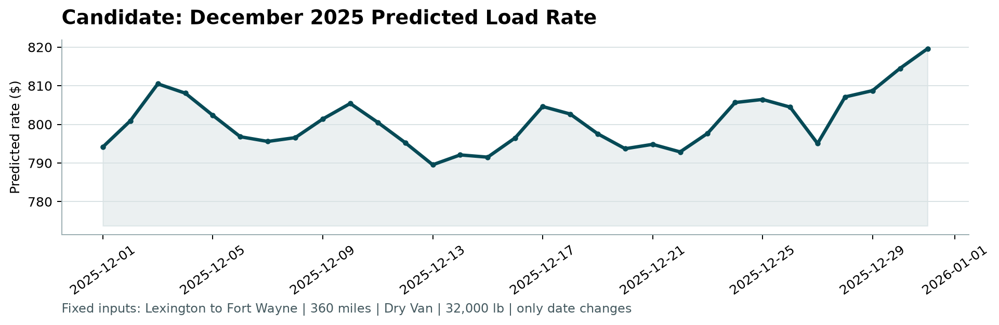

# Freight Rate Prediction Challenge

## 1. Executive Summary

This project predicts `posted_rate` for freight loads. The labeled development data contains 48,000 rows from January through October 2025. The final prediction file covers 12,000 future-dated loads from November and December 2025.

The selected final model is CatBoost with native categorical handling and deterministic settings. A time-based holdout was used: January 1 through August 31 for development and September 1 through October 31 for evaluation. The final model was then retrained on all 48,000 labeled rows.

## 2. Business Problem

Spotter requires a rate estimate for each freight load from its route, distance, equipment, weight, date, market index, and quote signal. This is a supervised regression problem with a continuous dollar-valued target.

## 3. Dataset

`data/train-test.csv` contains 48,000 labeled rows and 14 columns, including the `posted_rate` target. `data/validation.csv` contains 12,000 feature-only rows. `data/december-chart-inputs.csv` contains 31 fixed-input scenarios where only the date changes.

The development period is January 1 through October 31, 2025. The final validation period is November 1 through December 31, 2025.

## 4. Data Quality

The development data has 300 missing `weight` values and 374 missing `market_index` values. It contains 292 negative weights. The final validation data contains 165 missing weights, 249 missing market indices, and 145 negative weights. These rows were not deleted automatically. The model input includes missing and negative-weight indicators, while a non-negative `weight_clean` feature is used for weight-derived calculations.

There are no duplicate full rows or duplicate load IDs. Validation contains eight pickup cities and eight delivery cities not seen during development, and 736 validation routes are unseen. This makes direct route memorization unsafe.

The target is right-skewed, with mean 2,373.98, median 2,030.76, minimum 57.22, and maximum 25,533.00. Distance has a strong raw correlation with the target of approximately 0.909. Mean rates also differ by equipment type.

## 5. Exploratory Data Analysis

The target distribution is concentrated below approximately 5,000 dollars with a long upper tail. Distance is the dominant simple numeric relationship. Equipment differences support including equipment as a categorical feature. Date-derived variables and geographic differences were included to support temporal and route generalization.

## 6. Train/Validation Strategy

A random split was not used as the primary evaluation because the final prediction period is later than the labeled period. The development split used January 1 through August 31, 2025 for training and September 1 through October 31, 2025 for holdout evaluation.

The split contains 38,477 development rows and 9,523 holdout rows. All fallback mappings and model preprocessing are derived from the development portion during model comparison. Final training uses only the 48,000 labeled development rows; no November or December target values are available or used.

## 7. Feature Engineering

The pipeline uses:

- Native categorical features for pickup, delivery, equipment, and route.
- Date month, weekday, day of month, day of year, and elapsed time index.
- Log-transformed distance.
- Weight missing and negative indicators.
- Non-negative weight and weight per mile.
- Latitude and longitude differences.
- Training-derived coordinate mappings for the December input file.
- Training medians for December fields that are not supplied by that file: `market_index` and `quote_signal`.

The December fallbacks are calculated from training data only. This is necessary because the December input file contains only pickup, delivery, distance, equipment, weight, date, and the blank prediction column.

## 8. Model Experiments

| Model | MAE | RMSE | Notes |
|---|---:|---:|---|
| Median baseline | 1,148.92 | 1,569.42 | Reference only |
| Ridge | 148.43 | 642.32 | Fast linear model with one-hot categoricals |
| CatBoost | 144.84 | 651.98 | Native categoricals and nonlinear interactions |

## 9. Model Evaluation

CatBoost achieved the lowest MAE by approximately 3.59 dollars versus Ridge. Ridge achieved a slightly lower RMSE by approximately 9.66 dollars. CatBoost was selected for the final run because the task contains categorical routes, unseen categories, nonlinear distance effects, and missing values. The tradeoff is documented rather than treating one metric as universally decisive.

## 10. Final Model

The final model is CatBoost with 700 iterations, depth 8, learning rate 0.06, L2 regularization of 5.0, and random seed 42. It was retrained on all 48,000 labeled development rows.

## 11. Validation Predictions

`validation_predictions.csv` is populated from the supplied `data/validation-predictions-template.csv`. It contains exactly 12,000 rows and the required columns `load_id,predicted_rate`. Predictions are finite and strictly positive, and the IDs match the expected validation ID set.

## 12. December Forecast

The completed December file contains 31 dates from December 1 through December 31, 2025. The fixed route and load inputs were preserved. The scorer generated the required chart:

## 13. Key Findings

- A time-based split is necessary because the final period is future-dated.
- Distance is highly informative, but route and equipment categories add important structure.
- Negative and missing weights are real data-quality issues and should be handled explicitly.
- Unseen routes and cities make pure memorization risky.
- CatBoost and Ridge both substantially outperform the median baseline on the selected holdout.

## 14. Limitations

The provided scorer validates output structure and generates the chart but does not expose the official hidden accuracy metric. The model therefore uses MAE and RMSE for development evaluation. December inputs omit several training features, so training-only fallback values are required for those fields.

## 15. Future Improvements

With additional time, I would evaluate a second rolling time split, investigate subgroup error more deeply, test calibrated route/geographic encodings computed strictly inside folds, and compare a broader set of carefully controlled boosting configurations.

## 16. Conclusion

The project provides a reproducible time-aware regression pipeline, final validation predictions, December scenario predictions, a scorer-generated chart, and documentation of data-quality and model-selection decisions.